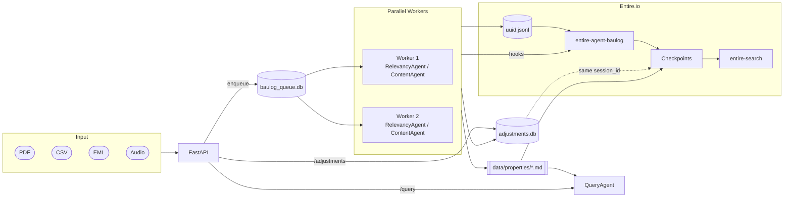
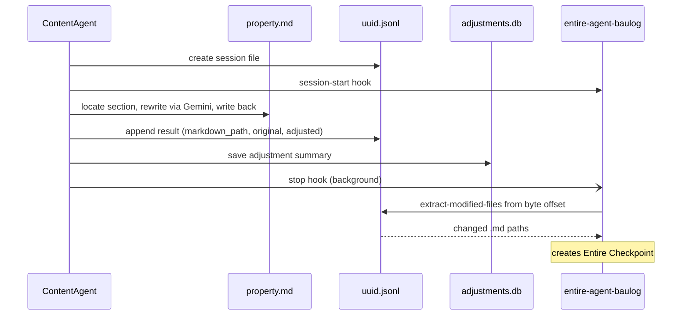

# Baulog

Property management document processing system. Accepts uploaded files (PDF, CSV, EML, audio), classifies them against a Markdown-based property registry using LangChain and Google Gemini, updates the relevant section in the property file, and exposes a natural-language query interface over the registry. Every content update is checkpointed via a custom [Entire.io](https://entire.io) external agent plugin, creating a versioned audit trail of all property file changes.

## Architecture



## How it works

```
File uploaded via API
        ↓
Text extracted & enqueued (immediate response)
  PDF  — text extracted in-memory via pypdf
  CSV  — each row enqueued as a separate item
  EML  — file saved to disk, parsed by worker
  Audio — file saved to disk, transcribed by worker via Gradium STT
        ↓
Worker picks up item
        ↓
RelevancyAgent — identifies property, building, unit, category
  └─ calls lookup_property_by_owner tool when owner name / email / IBAN
     appears instead of the property name
        ↓
ContentAgent — finds the matching section in the Markdown file and updates it
        ↓
Assessment stored in DB, result queryable via API
```

The property registry lives as Markdown files on the filesystem. The `QueryAgent` performs RAG over those files to answer natural-language questions about any property.

---

## Setup

**Requirements:** Python 3.11+, [uv](https://docs.astral.sh/uv/)

```bash
# Install dependencies
uv sync

# Configure environment
cp .env.example .env
# Fill in at minimum GOOGLE_API_KEY (and GRADIUM_API_KEY if using audio)

# Start the API server (worker starts automatically)
uv run python main.py
```

---

## Environment variables

| Variable | Default | Description |
|---|---|---|
| `GOOGLE_API_KEY` | — | **Required.** Google Gemini API key |
| `GRADIUM_API_KEY` | — | Required for audio transcription (speech-to-text) |
| `GEMINI_MODEL` | `gemini-2.5-flash-preview-05-20` | Gemini model used by all agents |
| `BAULOG_PROPERTIES_DIR` | `data/properties` | Directory where property Markdown files are stored |
| `BAULOG_RUN_WORKER` | `true` | Set to `false` to disable the background worker on startup |
| `BAULOG_WORKER_BATCH_SIZE` | `10` | Queue items processed per worker batch |
| `BAULOG_WORKER_POLL_INTERVAL` | `5` | Seconds between worker queue polls |

---

## Property Markdown schema

Properties are stored as Markdown files in `BAULOG_PROPERTIES_DIR`. Each file follows this heading hierarchy:

```markdown
# Property Name

## owner
- Owner or management company name

## insurance
- Policy details

## maintanance
- Property-level maintenance notes

## buildings

### building 12
#### maintenance
#### rent

### building 16
#### maintenance
#### rent

#### units

##### unit WE 01
###### maintenance
###### rent
###### tenant

##### unit WE 02
...
```

Section content is a list of `- item` bullet points. Empty sections are valid placeholders.

---

## Owner database

Owners are stored in SQLite (`data/baulog_queue.db`) and used by the RelevancyAgent to match documents that reference a management company rather than the property name directly. The search matches on name, email address, or IBAN — and falls back to word-by-word matching when the full query has no result, so STT transcription variants (e.g. `"und"` instead of `"&"`) still resolve correctly.

```python
from owner_repository import OwnerRepository

repo = OwnerRepository()
repo.add(
    name="Huber & Partner Immobilienverwaltung GmbH",
    property_name="WEG Immanuelkirchstraße 26",
    street="Friedrichstrasse 112",
    postal_code="10117",
    city="Berlin",
    email="info@huber-partner-verwaltung.de",
    phone="+49 30 12345-0",
    iban="DE89 3704 0044 0532 0130 00",
    bic="COBADEFFXXX",
    bank="Commerzbank Berlin",
    tax_number="13/456/78901",
)
```

---

## API endpoints

### File upload

| Method | Path | Accepted formats | Description |
|---|---|---|---|
| `POST` | `/upload/pdf` | `.pdf` | Text extracted in-memory, one queue item |
| `POST` | `/upload/csv` | `.csv` | Each data row enqueued as a separate item |
| `POST` | `/upload/eml` | `.eml` | Email file saved to disk, parsed by worker |
| `POST` | `/upload/audio` | `.wav .mp3 .m4a .ogg .flac .webm` | Audio saved to disk, transcribed via Gradium STT |

All endpoints accept `multipart/form-data` with a single `file` field. No extra headers required.

**Single-file response (PDF / EML / audio):**
```json
{
  "status": "enqueued",
  "message": "invoice.pdf text extracted and enqueued",
  "data_id": "550e8400-...",
  "enqueued_at": "2026-01-01T10:00:00"
}
```

**CSV response** (one entry per row):
```json
{
  "status": "enqueued",
  "message": "data.csv parsed and 42 rows enqueued",
  "row_count": 42,
  "data_ids": ["abc-123", "def-456", "..."],
  "enqueued_at": "2026-01-01T10:00:00"
}
```

---

### Queue management

| Method | Path | Description |
|---|---|---|
| `GET` | `/queue/status` | Counts by status (pending / processing / completed / failed) |
| `GET` | `/queue/item/{id}` | Details and assessment for a single item |
| `GET` | `/queue/completed?limit=100&hours=24` | Recently completed items |

Failed items are retried automatically up to **3 times** before being permanently marked as failed.

---

### Query (RAG)

```
POST /query
Content-Type: application/json

{ "prompt": "What is the maintenance schedule for building 16?" }
```

Response:
```json
{
  "answer": "The maintenance schedule for building 16 includes...",
  "sources": ["weg-immanuelkirchstrasse-26.md — WEG Immanuelkirchstraße 26 > buildings > building 16 > maintenance"]
}
```

The query agent parses all property files into heading-based sections, scores each section by relevance to the prompt (path matches weighted 3× over body matches), and feeds the top results to the LLM as grounded context.

---

### Adjustment history

```
GET /adjustments?limit=50
```

Returns the most recent content-agent updates — which section was changed, the original and updated content, and the action that triggered the change.

---

### Health check

```
GET /health
```

```json
{
  "status": "healthy",
  "agent_status": "ready",
  "query_agent_status": "ready",
  "worker_status": "running",
  "worker_stats": { "processed": 10, "completed": 9, "failed": 1, "errors": 1, "skipped": 0 }
}
```

---

## Agents

### RelevancyAgent

Reads uploaded document text and outputs:

```json
{
  "property": "WEG Immanuelkirchstraße 26",
  "building": null,
  "unit": "unit WE 49",
  "category": "maintenance",
  "action": "Invoice for janitorial services, garbage bin provision, and winter service."
}
```

- `property` — exact name from the Markdown registry (required)
- `building` — null when the document is property-level
- `unit` — null when not unit-specific
- `category` — one of `insurance | maintenance | rent | tenant`
- `action` — one or two sentence summary

When the property name is not in the document, the agent calls the `lookup_property_by_owner` tool, trying every name, email, and IBAN found in the document. For emails, all addresses from all header fields (From, To, CC, BCC, Reply-To, Sender) are collected and tried individually.

### ContentAgent

Takes the RelevancyAgent output, finds the matching section in the Markdown file, asks the LLM to update the content based on the action, and writes the result back to the file.

Section matching uses substring path matching with space-stripped fallback, so identifiers like `WE49` (from audio transcription) still match the heading `unit WE 49`. Property-level documents (no building or unit) prefer the shallowest matching section.

### QueryAgent

RAG pipeline over the property Markdown files:
1. Parses all files into `MarkdownSection` objects with heading paths and line numbers
2. Skips pure structural headings with no body content
3. Scores sections: path hits × 3 + body hits
4. Takes top 8 by score, re-sorts into document order for coherent context
5. Passes formatted sections to Gemini with a system prompt that restricts the answer to the retrieved data

---

## Audio transcription

Audio files are transcribed via the [Gradium](https://gradium.ai) speech-to-text WebSocket API (`wss://api.gradium.ai/api/speech/asr`). The file is loaded, resampled to 24 kHz mono PCM, and streamed in 80 ms chunks. The transcript is then passed through the normal RelevancyAgent → ContentAgent pipeline.

**Supported formats:** WAV, MP3, M4A, OGG, FLAC, WebM

Requires `GRADIUM_API_KEY` in `.env`.

---

## Worker

The background worker runs inside the same process as the API server (controlled by `BAULOG_RUN_WORKER`). It can also be run standalone:

```bash
uv run python worker.py                           # continuous polling
uv run python worker.py --once                    # process one batch then exit
uv run python worker.py --stats                   # print queue stats then exit
uv run python worker.py --batch-size 20 --poll-interval 2
```

---

## Entire integration

This repository is integrated with [Entire](https://entire.io) — an AI session checkpoint and search tool. Entire automatically snapshots every Claude Code and Codex session so you can search and replay past work.

### Hook configuration

| File | Purpose |
|---|---|
| `.claude/settings.json` | Hooks for Claude Code — fires on `SessionStart`, `SessionEnd`, `Stop`, `UserPromptSubmit`, and after `Task` / `TodoWrite` tool calls |
| `.codex/hooks.json` | Hooks for Codex — fires on `SessionStart`, `Stop`, `UserPromptSubmit` |
| `.codex/config.toml` | Enables Codex hook support |
| `.entire/settings.json` | Enables Entire for this repo, enables external agents |
| `.claude/agents/entire-search.md` | Claude Code sub-agent definition |
| `.codex/agents/entire-search.toml` | Codex sub-agent definition |

### entire-search sub-agent

Both Claude Code and Codex have an `entire-search` sub-agent registered. It is invoked automatically when you ask about previous work, past sessions, earlier prompts, or historical context. It uses `entire search --json` to query the checkpoint history for this repository and returns the most relevant matches.

### entire-agent-baulog

`entire-agent-baulog` is a custom Entire external agent plugin that connects the Baulog `ContentAgent` to the Entire checkpoint system. It is a Python script that must be placed on `$PATH` so the Entire CLI can discover and invoke it automatically.

**What it does:**

- Implements the Entire external agent protocol (version 1) over stdin/stdout JSON
- Fires three hook events tied to `ContentAgent` operations:
  - `session-start` — when a content-adjustment operation begins
  - `stop` — when an adjustment turn completes
  - `session-end` — when the session terminates
- Stores session transcripts as JSONL files in `.baulog/entire-sessions/`
- The `extract-modified-files` command parses those JSONL files to tell Entire which Markdown property files were changed by `ContentAgent.adjust()` — enabling Entire to create precise checkpoints of property file edits

**Capabilities implemented:**

| Capability | Subcommands |
|---|---|
| Core protocol | `info`, `detect`, `get-session-id`, `get-session-dir`, `resolve-session-file`, `read-session`, `write-session`, `read-transcript`, `chunk-transcript`, `reassemble-transcript`, `format-resume-command` |
| `hooks` | `parse-hook`, `install-hooks`, `uninstall-hooks`, `are-hooks-installed` |
| `transcript_analyzer` | `get-transcript-position`, `extract-modified-files` |

**Session lifecycle — how every Markdown adjustment becomes an Entire checkpoint:**



**Installation:**

```bash
# Make the script executable and place it on PATH
chmod +x entire-agent-baulog
cp entire-agent-baulog ~/.local/bin/entire-agent-baulog

# Verify Entire can find it
entire agents list
```

### Requirements

The `entire` CLI must be installed and on your `PATH`. If it is not found the hooks exit silently and no checkpoints are created.

```bash
# See: https://docs.entire.io/cli/installation#installation-methods
```

### Gitignored paths

`.baulog/entire-sessions/` is gitignored — session checkpoint files are local only and are never committed.

---

## Project structure

```
baulog/
├── main.py                  # FastAPI app — upload, query, adjustments endpoints
├── worker.py                # Background queue worker
├── queue_manager.py         # SQLite queue (data/baulog_queue.db)
├── owner_repository.py      # SQLite owner → property index
├── audio_transcriber.py     # Gradium STT WebSocket client
├── agents/
│   ├── config.py            # Shared config (model, paths, API keys)
│   ├── relevancy_agent.py   # Document classifier with owner lookup tool
│   ├── content_agent.py     # Markdown section updater
│   └── query_agent.py       # RAG query agent
├── context_engine/
│   ├── engine.py            # ContextEngine — searches property files
│   ├── markdown_parser.py   # Parses heading-based Markdown into sections
│   └── models.py            # PropertyContext, BuildingContext, UnitContext
├── data/
│   ├── properties/          # Property Markdown files (BAULOG_PROPERTIES_DIR)
│   ├── uploads/
│   │   ├── eml/             # Saved EML files (worker reads these)
│   │   └── audio/           # Saved audio files (worker transcribes these)
│   ├── baulog_queue.db      # Queue + owner database
│   └── adjustments.db       # Content-agent update history
├── .env.example
└── pyproject.toml
```
